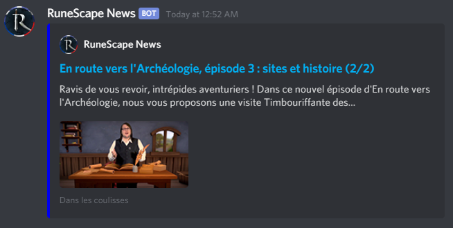

# RuneScape RSS to Discord Webhook
Par tranche de 15 minutes, ce programme Python vérifie la page de flux RSS de la version française de RuneScape pour envoyer les nouveautés dans un serveur Discord à l'aide de webhooks.

Ajoutez le lien de votre webhook Discord et de l'icône souhaité aux variables vide au début du fichier.

Ce programme nécessite 3 modules Python pour s'exécuter. Utilisez l'utilitaire pip pour les installer.

* [discord_webhook](https://github.com/lovvskillz/python-discord-webhook)
* [bs4](https://pypi.org/project/beautifulsoup4/)
* [lxml](https://lxml.de/)

### Attention
Ce code ne fonctionnera qu'avec la page de flux RSS de la version française RuneScape.

